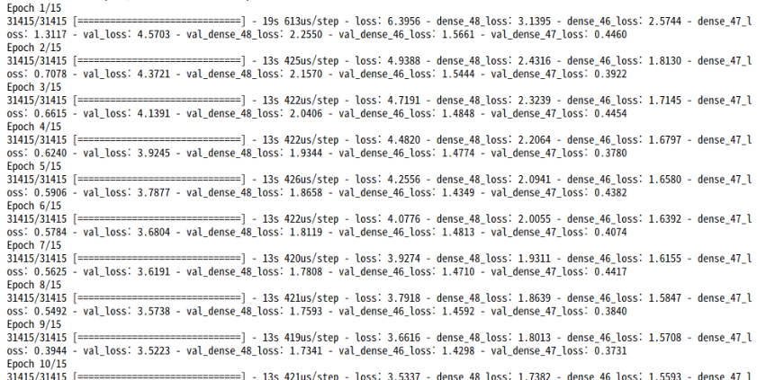

# EmotionChatbot

<b>EmotionChatbot</b>은 케라스로 만들어진 챗봇입니다. sequence-to-sequence 기반의 chitchat generation과, 동시에 Emotion classification 및 action analysis의 출력이 가능한 모델입니다.

#### output 출력 예시


---

## Contents

- [about model](#about-model)
- [about data](#about-data)
- [customizing](#customizing)

## about model

<b>EmotionChatbot</b>의 케라스로 구현된 모델은 아래와 같습니다.


인풋 문장이 임베딩 처리가 끝난 뒤 Encoder LSTM으로 들어가게 됩니다. 이 LSTM의 hidden state가 두 갈래로 나뉘어 feed forward하게 되는데, 한 갈래는 Decoder LSTM으로 들어가서 아웃풋 문장을 생성하고, 다른 한 갈래는 Classifier로 들어가서 Emotion과 Action을 분류하게 되는 모델이 됩니다. 즉, multiple output이 있는 sequence to sequence 기반의 모델입니다.

모델의 케라스 코드는 아래와 같습니다.
```py
#Encoder LSTM
encoder_inputs = Input(shape=(None,))
encoder_embedding =  Embedding(numWords, embeddingSize)
x = encoder_embedding(encoder_inputs)
encoder =  LSTM(LSTMHidden, return_state=True)
x, state_h, state_c = encoder(x)
encoder_states = [state_h, state_c]

#MLP Classifier
for_classification = Concatenate(axis=-1)(encoder_states)
action_output = Dense(4, activation = 'softmax')(for_classification)
emotion_output = Dense(7, activation = 'softmax')(for_classification)

#Decoder LSTM
decoder_inputs = Input(shape=(None,))
decoder_embedding = Embedding(numWords, embeddingSize)
x = decoder_embedding(decoder_inputs)
decoder = LSTM(LSTMHidden, return_sequences=True, return_state=True)
decoder_outputs, _, _ = decoder(x, initial_state=encoder_states)
decoder_dense = Dense(numWords, activation='softmax')
decoder_outputs = decoder_dense(decoder_outputs)

model = Model([encoder_inputs, decoder_inputs], [decoder_outputs,action_output, emotion_output])

```

본 모델이 학습을 진행하게되면 아래와 같은 화면이 출력됩니다.



## about data

<b>EmotionChatbot</b>의 학습 데이터는 전체 공개하기 어려워서 Github에 업로드하지 않았습니다. 코드를 사용하시는 분이 자유롭게 자신의 데이터를 테스트 해보시면 되겠습니다.
데이터는 인풋 아웃풋의 문장 쌍과, 해당 발화의 Action analysis와 Emotion classification으로 구성되어 있습니다.

- sentence pair
  - input sentence
  - output sentence
- Action analysis
  - Inform
  - Question
  - Directive
  - Commisive

- Emotion analysis
  - neutral
  - anger
  - disgust
  - fear
  - happiness
  - sadness
  - surprise

## customizing

아래 하이퍼파라미터들 및 모델의 구조를 커스터마이징할 수 있습니다.

```py
maxWordsInSentence = 20
epochs = 15
numWords = 10000
embeddingSize = 256
LSTMHidden = 512
batch_size=256
```